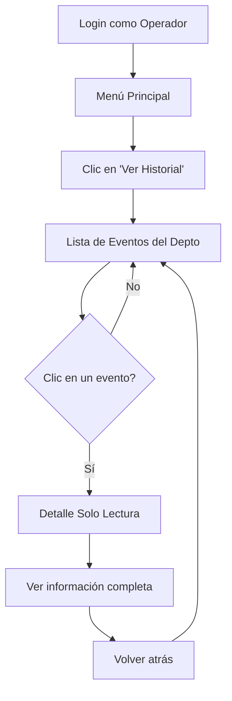

# ✅ Implementación Completada: Historial de Acceso para Operadores

## 🎯 Objetivo Logrado
Los **operadores (usuarios normales)** ahora pueden ver el historial completo de accesos del departamento en **modo solo lectura**, sin capacidad de controlar la barrera.

---

## 📊 Resumen de Cambios

### ✨ Nuevos Archivos (2)
1. ✅ `depto_control_listado_acceso_readonly.kt` - Actividad de detalle solo lectura
2. ✅ `activity_depto_control_listado_acceso_readonly.xml` - Layout sin botones de control

### 🔧 Archivos Modificados (2)
1. ✅ `depto_usuario_historial.kt` - Ahora muestra todos los eventos del departamento
2. ✅ `AndroidManifest.xml` - Registro de la nueva actividad

---

## 🔄 Diferencias Clave

| Característica | Admin | Operador |
|---|---|---|
| **Ver historial completo** | ✅ Sí | ✅ Sí |
| **Ver detalles de eventos** | ✅ Sí | ✅ Sí |
| **Botón "Permitir Acceso"** | ✅ Sí | ❌ No |
| **Botón "Denegar Acceso"** | ✅ Sí | ❌ No |
| **Abrir barrera manualmente** | ✅ Sí | ❌ No |
| **Indicador "(Solo lectura)"** | ❌ No | ✅ Sí |

---

## 📱 Pantallas

### Operador - Lista de Eventos
```
┌─────────────────────────────┐
│   📋 Historial de Accesos   │
├─────────────────────────────┤
│ ✅ ACCESO_TARJETA           │
│ 📅 2025-12-04 10:30:15      │
│ 🔑 Sensor: SENSOR-001       │
│ 👤 Usuario: Juan Pérez      │
├─────────────────────────────┤
│ ❌ ACCESO_TARJETA           │
│ 📅 2025-12-04 09:15:22      │
│ 🔑 Sensor: SENSOR-002       │
│ 👤 Usuario: María López     │
├─────────────────────────────┤
│ ✅ APERTURA_MANUAL          │
│ 📅 2025-12-04 08:45:10      │
│ 🔑 Sensor: SENSOR-001       │
│ 👤 Usuario: Admin           │
└─────────────────────────────┘
     ⬇️ (Click en evento)
```

### Operador - Detalle del Evento
```
┌─────────────────────────────┐
│         🏢 [LOGO]           │
│                             │
│   Detalle del Evento        │
│     (Solo lectura)          │
├─────────────────────────────┤
│ Estado:  ✅ PERMITIDO       │
│ Fecha:   2025-12-04 10:30   │
│ Usuario: Juan Pérez         │
│ Tipo:    ACCESO_TARJETA     │
│ Sensor:  SENSOR-001         │
├─────────────────────────────┤
│   [No hay botones aquí]     │
└─────────────────────────────┘
```

### Admin - Detalle del Evento
```
┌─────────────────────────────┐
│         🏢 [LOGO]           │
│                             │
│   Control de Barrera        │
├─────────────────────────────┤
│ Usuario: Juan Pérez         │
│ Fecha:   2025-12-04 10:30   │
│ Estado:  ✅ PERMITIDO       │
├─────────────────────────────┤
│  ┌───────────────────────┐  │
│  │  ✅ Permitir Acceso   │  │
│  └───────────────────────┘  │
│  ┌───────────────────────┐  │
│  │  ❌ Denegar Acceso    │  │
│  └───────────────────────┘  │
└─────────────────────────────┘
```

---

## 🚀 Flujo de Usuario (Operador)



---

## 🔐 Seguridad

- ✅ **Sin permisos de control:** El operador NO puede activar/desactivar la barrera
- ✅ **Solo lectura:** Los botones de acción no están presentes en el código
- ✅ **Transparencia:** El subtítulo "(Solo lectura)" informa al usuario sus limitaciones
- ✅ **Mismo nivel de información:** El operador ve los mismos datos que el admin (sin capacidad de modificación)

---

## ✅ Estado de Compilación

```
BUILD SUCCESSFUL in 799ms
34 actionable tasks: 34 up-to-date

Warnings (no críticos):
- Deprecaciones menores en getColor() (comportamiento normal)
```

---

## 🧪 Checklist de Pruebas

Antes de considerar completada la implementación, verificar:

- [ ] Login como operador funciona
- [ ] Se muestra el historial completo del departamento (no solo del usuario)
- [ ] Lista incluye eventos de todos los usuarios
- [ ] Al hacer clic en un evento, se abre la pantalla de detalle
- [ ] Pantalla de detalle muestra: Estado, Fecha, Usuario, Tipo, Sensor
- [ ] **NO aparecen** botones de "Permitir Acceso" o "Denegar Acceso"
- [ ] Se muestra el texto "(Solo lectura)" en la pantalla de detalle
- [ ] Colores diferenciados (verde para PERMITIDO, rojo para DENEGADO)
- [ ] Login como admin sigue funcionando con todos los controles

---

## 📝 Notas Técnicas

### Endpoint Compartido
Tanto admin como operador usan el mismo endpoint:
```
GET http://54.89.22.17/listar_eventos.php?id_departamento=X
```

### Actividades Separadas
- **Admin detalle:** `depto_control_listado_acceso` (CON botones)
- **Operador detalle:** `depto_control_listado_acceso_readonly` (SIN botones)

Esto asegura separación completa de permisos a nivel de código.

---

## 🎉 Resultado Final

**El operador ahora puede:**
1. ✅ Ver TODO el historial de accesos del departamento
2. ✅ Ver quién accedió, cuándo y con qué sensor
3. ✅ Identificar eventos permitidos y denegados
4. ✅ Monitorear la actividad sin poder intervenir

**El operador NO puede:**
1. ❌ Permitir accesos manualmente
2. ❌ Denegar accesos manualmente
3. ❌ Activar la barrera
4. ❌ Modificar eventos registrados

---

**✨ Implementación completada exitosamente ✨**

